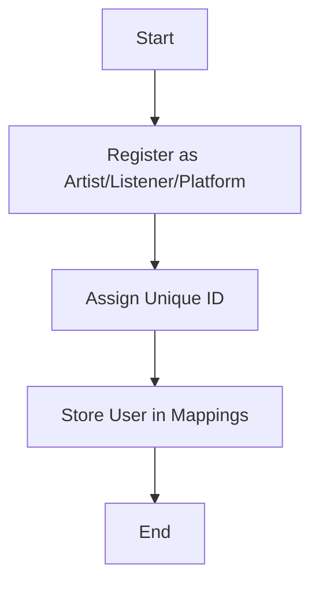
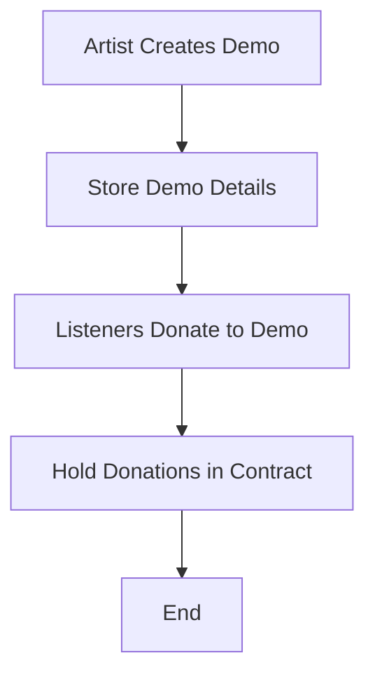
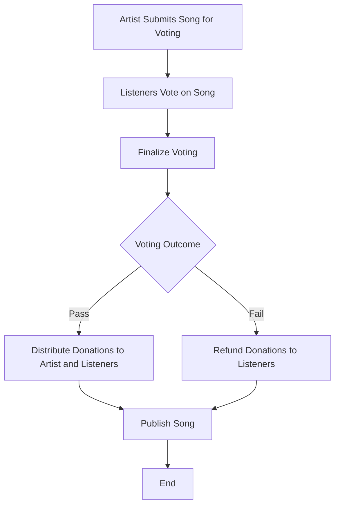
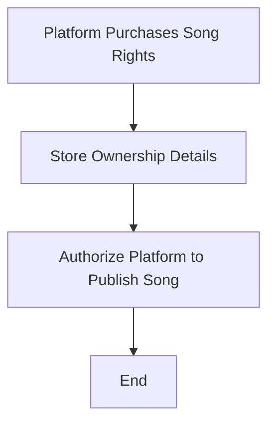

## Overview

The `VibeStake` smart contract is a decentralized application (DApp) designed to facilitate collaboration between artists, listeners, and platforms in the music industry. It enables artists to publish demos, receive donations, and create songs. Listeners can donate to demos, vote on songs, and earn stakes in songs. Platforms can purchase rights to publish songs for a specific duration. The contract ensures transparency and fairness in profit distribution and intellectual property protection.

---

## Features

1. **User Registration**:
   - Users can register as an `Artist`, `Listener`, or `Platform`.
   - Each user type has specific roles and permissions.

2. **Demo Creation and Donation**:
   - Artists can create demos and upload them to the platform.
   - Listeners can donate to demos during a specified donation period.

3. **Song Publishing and Voting**:
   - Artists can publish songs directly or submit them for voting.
   - Listeners who donated to a demo can vote on the corresponding song.

4. **Profit Distribution**:
   - Donations are distributed to artists and listeners based on voting outcomes.
   - Platforms can purchase publishing rights for songs, and profits are shared among stakeholders.

5. **Platform Authorization**:
   - Platforms can purchase rights to publish songs for a specific duration.
   - Artists or platforms can unauthorize publishing rights after expiration.

6. **Data Retrieval**:
   - Users can retrieve details about artists, listeners, platforms, demos, and songs.
   - Users can also view their profit and other relevant information.

---

## Logic Flow

### 1. **User Registration**
   - Users register as `Artist`, `Listener`, or `Platform` using the respective functions:
     - `registerArtist(string memory _name)`
     - `registerListener(string memory _name)`
     - `registerPlatform(string memory _name)`
   - Each user is assigned a unique ID and stored in mappings for easy retrieval.

### 2. **Demo Creation and Donation**
   - Artists create demos using the `addDemo` function:
     - Provide demo name, genre, donation period, and IPFS hash.
   - Listeners donate to demos using the `donateToDemo` function:
     - Donations are held in the contract until the song is published or the donation period ends.

### 3. **Song Publishing**
   - Artists can publish songs directly if no donations exist using the `publishSong` function.
   - If donations exist, the song must go through a voting process:
     - Submit the song for voting using `submitSongsForVoting`.
     - Listeners vote on the song using `voteOnSong`.
     - Finalize the voting process using `finalizeSongVoting`.

### 4. **Profit Distribution**
   - If voting passes, donations are distributed:
     - 90% to the artist (minus a 10% platform commission fee).
     - 10% to listeners based on their donation proportion.
   - If voting fails, donations are refunded to listeners.

### 5. **Platform Authorization**
   - Platforms purchase publishing rights using `purchaseSong`.
   - Rights can be revoked after expiration using `unauthorizePlatform`.

---

## Workflow

### User Registration

### Demo Creation and Donation

### Song Publishing and Voting

### Platform Authorization

---

## Contract Functions

### User Registration
- `registerArtist(string memory _name)`
- `registerListener(string memory _name)`
- `registerPlatform(string memory _name)`

### Demo Management
- `addDemo(string memory _demoname, string memory _genre, uint256 _donationdays, string memory _ipfshash)`
- `donateToDemo(uint256 _demoID)`
- `returnDonation(uint256 _demoID)`

### Song Management
- `publishSong(uint256 _demoID, string memory _songName, string memory _genre, string memory _ipfshash)`
- `submitSongsForVoting(uint256 _demoID, string memory _songName, string memory _genre, string memory _ipfshash)`
- `voteOnSong(uint256 _semisongID)`
- `finalizeSongVoting(uint256 _semisongID)`

### Platform Management
- `purchaseSong(uint256 _songID, uint256 _purchaseDays)`
- `unauthorizePlatform(uint256 _songID, uint256 _platformID)`

### Data Retrieval
- `getListArtists()`
- `getListPlatforms()`
- `getListDemos()`
- `getListSongs()`
- `getDemoDetails(uint256 _demoID)`
- `getSongDetails(uint256 _songID)`
- `getMyProfit()`

---

## Events

- `demoAdded`
- `demoDonation`
- `SongPublished`
- `SongSubmitted`
- `songVotingUpdate`
- `songVotingResult`
- `platformPurchase`
- `platformUnauthorize`

---

## Notes

- **Commission Fee**: A 10% commission fee is deducted from all transactions.
- **IPFS Integration**: Demos and songs are stored on IPFS for decentralized storage.
- **Voting Threshold**: Songs require at least 50% of the total donation amount in votes to pass.

---

## License

This project is licensed under the MIT License.
